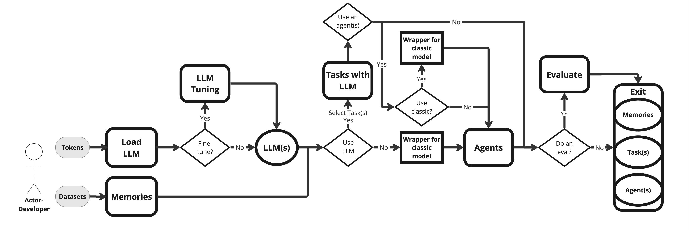

# RecaLLMate
RecaLLMate: python framework for flexible and reproducible study of large language models based recommender systems


# Overview
The framework is aimed at developing recommender systems that utilize large language models. 
It includes the following key modules: 
- working with user and item features (data)
- functionality for loading and fine-tuning LLMs (llm)
- solving recommendation problems with LLMs (tasks)
- interface for wrapping and using classical RecSys modules
- functionality for using agent-based approaches, generating instruments, memory and parsing responses for agents (agents)
- evaluation of RecSys results (evaluate)

# Examples
First of all, you need to install the necessary dependencies:
```
pip install -r requirements/requirements.txt
```

 - [information retrieval](./examples/information_retrieval.ipynb)
